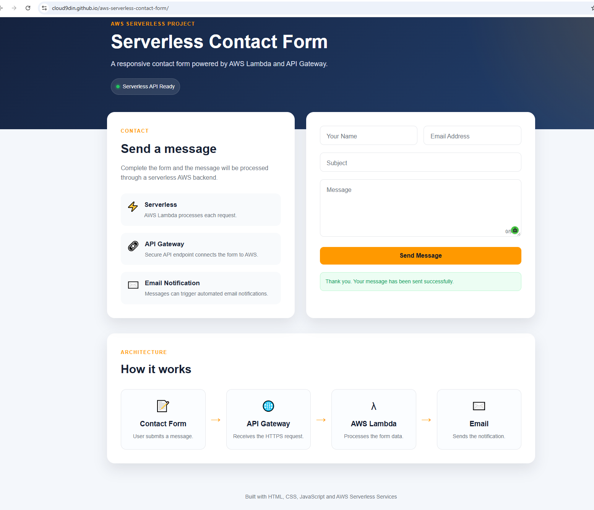

# AWS Serverless Contact Form

A serverless contact form built with HTML, CSS, JavaScript and AWS services including Lambda, API Gateway, IAM and Amazon SES.

## Live Demo

https://cloud9din.github.io/aws-serverless-contact-form/

## Features

- Responsive contact form
- Client-side form validation
- Character counter
- Loading state during submission
- Success and error messages
- AWS API Gateway integration
- AWS Lambda backend
- IAM permissions
- Amazon SES email integration
- CORS configuration
- Environment variables for email settings

## Architecture

Contact Form → API Gateway → AWS Lambda → Amazon SES

## Technologies Used

- HTML5
- CSS3
- JavaScript
- AWS Lambda
- Amazon API Gateway
- Amazon SES
- AWS IAM
- Git
- GitHub
- GitHub Pages

## How It Works

1. The user completes the contact form.
2. JavaScript sends the form data to API Gateway.
3. API Gateway invokes the Lambda function.
4. Lambda validates and processes the request.
5. Amazon SES handles the email notification.
6. The website displays a success or error message.

## AWS Configuration

The project uses:

- IAM execution permissions
- Lambda environment variables
- API Gateway HTTP API
- CORS configuration
- SES verified email identity

## Screenshot

Add your project screenshot here:

## What I Learned

This project helped me practise:

- Building serverless applications
- Connecting frontend JavaScript to an API
- AWS Lambda development
- API Gateway configuration
- IAM permissions
- CORS troubleshooting
- Environment variables
- Amazon SES email integration
- Debugging using browser developer tools and AWS Lambda testing

## Project Status

The serverless frontend, API Gateway and Lambda integration are working successfully.

Amazon SES is configured and accepting email requests. Email deliverability is being further tested and refined.
